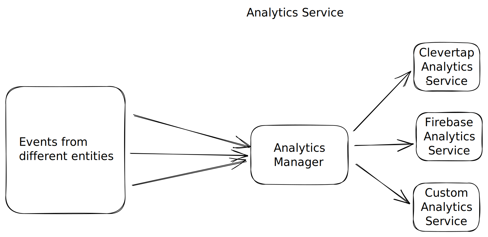

# Analytics Manager
- Design a general purpose analytics manager
- The manager would send events to remote analytics service which would process them and make it available to product/business team to take next decisions.

## Requirement Gathering
- System should be able to send events to the servers of analytics server providers
- Our system should be accessible from anywhere (across the app)
- Should be easy to use `fun track(event: Event)` or `fun log(event: Event)`
- Should be able to send multiple events
- Each event can have multiple parameters
- Should be able to set/unset user properties
- Should be able to support multiple Analytics Service Providers (multiple sdks will be used e.g. Clevertap, Firebase, Google Analytics, Custom backend, MoEngage, Amplitude)
- Should be able to send different events to different analytics services
- For the same event, event name and/or properties can be different for different analytics services
- System should be scalable i.e. events and parameters can be added/removed easily
- System should be testable
- Should be able to work in low/no network conditions (should store events in offline state and send them when the system is online)

## Identifying technical requirements
- **Accessible from anywhere** - (Analytics manager) Inject instance for each entity or use Singleton. I'd prefer singleton here as it is simpler and its sole job is to get data from entities and pass to the network layer or analytics services
- **Multiple analytics services** - Our analytics manager should have an instance of all of them. Single method should trigger the track or send method of all of them
- **Event name or params can change from service to service** - Each analytics service should be treated as a separate entity. To logic to change event name or param should be within this entity
- **Should be testable** - Always work with interfaces/contracts so that instances are easily replaceable with mocks for testability

## High level diagram

[Reference](https://www.youtube.com/watch?v=pfrjGFDXRt4&ab_channel=iCode)
