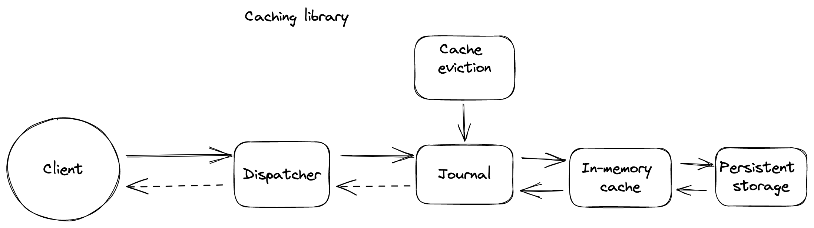

# Caching Library
[Reference](https://github.com/weeeBox/mobile-system-design/blob/master/exercises/caching-library.md)

## Requirements

### Functional requirements
- General purpose caching library
- User should be able to store and retrieve raw bytes of data using string as a key. (We can make even key generic by having a CacheableKey interface and the key that is going to be used can implement this interface)
- User should be able to configure disk and memory limit usage as part of library initialisation
- User should be able to configure eviction policy as part of library initialisation
- User should be able to control if and which of the data stored is encrypted

### Non-functional requirements
- Cached data should be persisted on disk
- A subset of cached data should be stored in memory for quicker access
- Once the cache is full a portion of items should be deleted as per the eviction policy

### Out of scope
- User-defined eviction policies
- Cross-platform support

## Client Public API
Cache:
- init(config: CacheConfig)
- set(key: String, val: [byte]): CacheTask
- get(key: String): CacheTask
- clear(key: String): CacheTask
- clearAll()

CacheConfig:
- init(maxMemomryCacheSize: Int, maxDiskCacheSize: Int)

CacheTask:
- isSuccessful(): Boolean
- getData(): [byte]?
- getErrorMessage(): String?
- addOnCompleteCallback(callback: (CacheTask) -> Unit)

## High Level Diagram


### Components
- **Client** - Makes a request to store or retrieve data from the cache.
- **Dispatcher** - Entry point to the caching library, responsible for asynchronously storing or retreiving data.
- **Journal** - Maintains a structural record of metadata of cached items (access count, timestamp, size etc.)
- **In-memory storage** - Limited storage in memory meant for quicker access of items based on some logic to keep it efficient
- **Persistent storage** - Disk storage relatively bigger in size as compared to in memory storage but is relatively slower as well
- **Cache eviction** - Manages cache overflow and item eviction

### Flow
- Client makes a request to store or retrieve data
- Dispatcher uses an available worker to process the request asynchronously. We are doing work asynchronously as item access might lead to blocking I/O operations and doing this work synchronously on the main thread can lead to jank, ANRs and app termination.
- In-memory storage in case of read operations checks if the requested data is available, and returns it if available, else makes call to persistent storage to retrieve data, stores the retrieved data (if available) and returns it back.
- In case of writes the data will be written to persistent storage directly and a copy of it can be stored in in-memory cache for future use.
- Journal keeps a log of every read or write operation and updates the metadata accordingly
- In case of cache overflow, cache eviction decides which data to evict with the help of metadata stored in journal and the pre-defined eviction policy.
- Data is returned to the dispatcher via callbacks (or other asynchronous mechanism which then forwards it asynchronously to the client)

## Deep dive

### Dispatcher
- Its main job is to simplify read/write concurrency.
- It can use executor or coroutines to asynchronously perform the requested operation
- It will pass the response receieved via worked/coroutine and pass it on the main thread to the client

### Journal
- Its responsibility is to store and update metadata related to cached data
- Each time the cache is accessed, the journal updates the access count, last access time. When a new data gets written, a new entry is created into the journal consisting of access count, last access time stamp and size of the data. Id can be the key against which the data gets stored. Journal data can be stored in a text/binary file or in a relational database. Relational database would be preferred as it allows partial updates, querying and data integrity.

<div align="center">

name | type
--- | ---
key | String
access_count | Int
last_accessed | Date
size | Int
  
</div>

#### Two ways of storing data
- Data can be stored separately as binary files and its path can be stored in the journal. The problem with this approach is, it can lead to inconsistency between the data and journal in cases when journal gets updated but data writing fails. This can be minimised by updating the journal only when data write is successful, but still there can be synchronisation issues and handling this can make the design complicated. To solve for the data inconsistency issue we can keep a state variable whose values will be ```CLEAN```, ```DIRTY```. Whenever data is going to be created/updated against a key we will mark its journal entry state as ```DIRTY``` and set it back to ```CLEAN``` when the write is successful. On journal initialisation we can delete ```DIRTY``` entries and their corresponding data if any. The advantage of this approach is if the device runs low on memory user can clear app cache (including binary files) from app settings

<div align="center">
  
name | type
--- | ---
key | String
access_count | Int
last_accessed | Date
size | Int
path | String
state | Int
  
</div>

- Data can be stored alongside journal entry as a BLOB. This approach simplifies implementation as we don't need to worry about synchronisation. The journal and persistent storage tables can be combined into one. The disadvantage of this approach is we can't remove the data when device runs low on memory like we could in the previous approach. This approach feels simpler to implement but it'll make the table bloated with data

<div align="center">
  
name | type
--- | ---
key | String
access_count | Int
last_accessed | Date
size | Int
data | BLOB
  
</div>

### Cache Eviction
When an item needs to be stored, the cache eviction checks if the size of the in-memory cache or persistent storage has exceeded the configured size, if it has it evicts data following the defined cache eviction policy until enough space is available for the new item. We can run prepared queries to make the eviction operations fast.

## Follow-up questions
### Storing sensitive information
Dont't have much knowledge around this, but as per the referenced doc we can encrypt the entire cache or let user decide which data to encrypt depending on the application requirement. To the best of my knowledge Android does not provide a secure built-in database at the moment, so as a workaround we can use a 3rd-party library like SQLCipher to encrypt the whole database or encrypt just the data BLOB (under the strong assumption that the cache keys do not store any sensitive information).

For a general purpose use case we can go ahead with BLOB encrytion approach letting the user choose which data to encrypt rather than encrypting all data or the entire database, also adding 3rd party library can cause licensing issue and binary/version incompatibility with the host application. The encryption key can be generated and stored in keystore/keychain. We should also store an encrypted flag in journal to identify encrypted data

<div align="center">
  
name | type
--- | ---
key | String
access_count | Int
last_accessed | Date
size | Int
data | BLOB
encrypted | Bool
  
</div>

Many application have their own encryption stack, so we can provide them a way to provide their encryption implementation by exposing some APIs

CacheEncryption:
- encrypt(data: [byte]): [byte]
- decrypt(data: [byte]): [byte]

CacheConfig:
- setCacheEncryption(encryption: CacheEncryption)

This way application can have better control over data privacy e.g. by downloading encryption key from backend on user login etc.

### Cross-platform support
Don't have much knowledge around this but we can try separating the code into two parts
1. common code - this would be shared across platforms (written in C/C++). Journal, Cache Eviction and Database will be part of the common code
2. platform specific code - written in (java/kotlin). Dispatcher, in-memory storage can be part of platform specific code

Native code (C/C++) is 
1. difficult to debug
2. hard to debug crash logs
3. can crash the application instead of throwing exceptions
4. need to compile for all supported architechtures (arm7, arm64, x86)
5. difficult to develop as compared to modern languages
6. android developers are less likely to contribute to it
