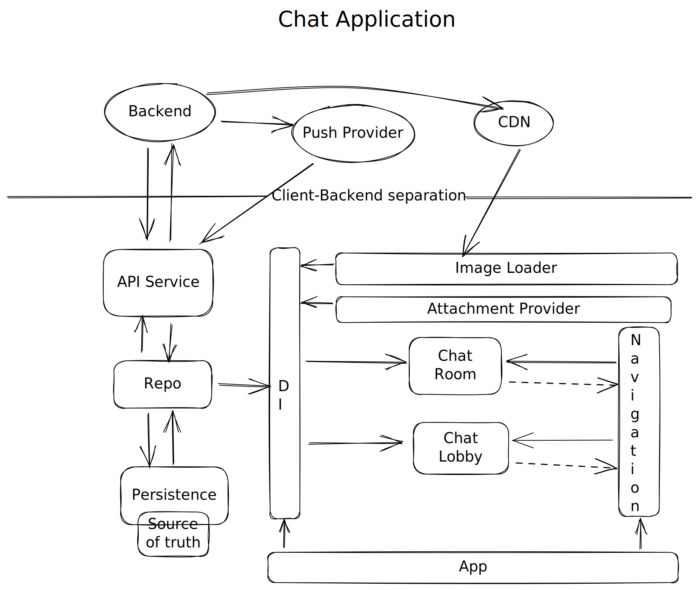
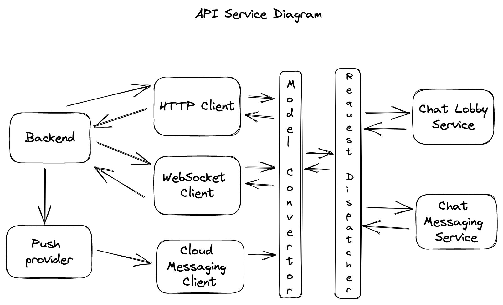

# Chat Application
[Reference](https://github.com/weeeBox/mobile-system-design/blob/master/exercises/chat-app.md)

## Requirement Gathering

### Functional Requirements
- User should be able to see list of his recent chats
- User should be able to open 1-on-1 chat and send and receive messages
- Image attachments to messages
- User should be able to see the status of the messages (sending/sent/failed) and read receipts

### Non-functional requirements
- Offline support (reading messages)
- Secure message storage
- Real-time notifications

### Out of scope
- Video and voice messages
- Sign-up and log-in
- Delete/Edit message
- Group chats

## HLD


## Components

### Server-side components
- **Backend** - Represents the whole backend infrastructure, responsible for responding to request from clients.
- **Push-provider** - Represents the mobile push infrastructure, receives push payload from backend and delivers it to the clients.
- **CDN** - Responsible for delivering static content to clients

### Client-side components
- **API Service** - Abstracts the client-server communication from the rest of the system
- **Persistence** - The single source of truth, the data received by the system gets persisted on the disk and propagated to other components.
- **Repo** - A mediator between API service and persistence. Receives requests from other components to get/post data, requests the data from persistence and provides to other components or requests/posts the data from/to API service, saves the data receieved from API service to persistence and then propagates it to other components
- **Chat Lobby** - Represents a set of components responsible for displaying a list of recent chats
- **Chat Room** - Represents a set of components responsible for displaying a single chat
- **DI** - Responsible for providing dependencies to components
- **Image Loader** - Responsible for loading images from web/disk into UI elements
- **Attachment Provider** - Responsible for loading attachments from gallery and camera into memory
- **Navigation** - Responsible for coordinating flow logic between chat lobby and chat room. Helps decouple components of the system from each other
- **App Module** - Responsible for gluing the system together 

## Deep Dive

### API Service
- Abstraction of newtwork communication layer. Idea is to isolate low-level transport primitives from the rest of the app to promote modularity and testability.
- The communication between the client and the server can be split up into 3 major categories

#### Bi-directional communication layer
- This is required for real-time communication between two clients. Each client will establish bi-directional connection with the server for sending/receiving messages and status.
- We need to decide between TCP (connection-based) and UDP (connectionless) protocols
    - TCP-based clients establish virtual connection and guarantee order delivery of messages by retransmitting lost packets. Because of this they are more expensive in terms of battery life (especially on flaky networks where connection has to be established multiple times). Another disadvantage is the 64k limit on connection count for host ports and bigger packet header size as compared to UDP. Some examples of TCP-based protocols are Web Sockets (Slack), XMPP (WhatsApp, Zoom, Google Talk) and MQTT (IoT, Smart Home)
    - UDP-based clients are lightweight and don't require any handshakes, but they don't guarantee ordered delivery of messages and has no error checking beyond simple checksums. Some examples of UDP-based protocols are WebRTC (Discord, Google Hangouts, Facebook Messenger)
- Given I don't have much knowledge of these options, best choice would be to do a quick PoCs around a few of them and pick whichever seems most appropriate. For now we can think of going ahead with WebSockets, the disadvantage of this would be the protocol is schemeless and does not provide automatic reconnection as well as some security flaws. Alternatively we can try HTTP-polling but it would generate an excessive amount of backend traffic. There is also gRPC (bi-directional streaming) or graphQL (subscriptions) as an option but I don't have much experience on these yet
- We will need web-socket to send and receive real-time chat events, for everything else we can use HTTP-based protocol. A typical event can look something like this
```
{
    connectionId: String,
    eventType: "HELLO|MSG_IN|MSG_OUT|MSG_READ|BYE"
    payload: {...}
}
```
Params:
- connectionId - For server to differentiate between clients
- eventType - To identify the event and process the payload. Different event types are:
    - **HELLO** - To establish a connection (bi-directional)
    - **MSG_IN** - Incoming message
    - **MSG_OUT** - Outgoing message
    - **MSG_READ** - Read receipt (bi-directional)
    - **BYE** - To close a connection
- Will contain the message and/or its payload


- HELLO and MSG_READ messages will be bi-directional implying they can be sent by both the client and server. HELLO will be sent by client to establish connection and server can reply back with a hello as an acknoledgement. MSG_READ a client will send as an acknowledgement for message read and server will forward this to the other client part of the chat room.
- When the app goes in background we don't need to keep the socket connection alive, we can use push notifications to let the client know of new messages and bring the app back in foreground

#### HTTP-based layer
- Request-response layer for getting paginated list of chats or message history
- REST protocol could be a good choice since we don't need request customisation to think of GraphQL which will also increase backend complexity
- Potential endpoints
    - ``GET /login`` - initiates a new client session and returns a JSON Web Token which will be used to authorizing further requests
    - ``GET /chats?before_id=<X>&limit=<Y>`` - receives a paginated list of chats
    - ``GET /chats/<chat_id>/messages?before_id=<X>&limit=<Y>`` - receives a paginated list of messages from a specific chat
- JWT token is needed for authentication. Every request after login should include Authorization header: ``Authorization: Bearer <token>``
- ``before_id`` used while getting chats or messages is for cursor based pagination, it contains the id of the chat/message before which ``limit`` no. of chat/messages are to be fetched. We can also used keyset based pagination based on timestamp of the last message, but it might not be reliable as we cannot trust a clients device clock.
- Some of the HTTP response codes we can discuss are:
    - ``401 Unauthorized`` - the client auth token is missing or expired or incorrect. A login request must be made to get a new auth token to proceed further
    - ``Unprocessable Entity`` - the client request data in malformed and should not be retried
    - ``429 Too Many Requests`` - the client reached the rate-limiting threshold
    - ``500 Internal Server Error`` - the client should use exponential back-off to retry the failed request

#### Cloud messaging layer
- A typical push payload will look something like
```
{
    user_id: String,
    messages: [
        {
            user_name: String,
            text: String,
            created_at: long
        },
        ....
    ]
}
```
    - We need both user_id and user_name because user_id will be used to verify the receiver is the same user who is intended to recieve the message, there is a chance that a new user has logged in on the same device, we won't want to show him the messages of the previous user, user_name will be used with text which will contain the first 100-120 characters of the message to display in the notification in system tray
    
#### API Service Diagram


- Having separate interfaces (protocols) between network layer and business logic layer: ChatLobbyService (receive a list of chats, create/delete chats) and ChatRoomService (receive message history, send/receive messages, download/upload attachments) allows us to decouple different modules of the app, for e.g. the Chat Lobby flow can recieve the ChatLobbyService via DI and use the exposed APIs via interface without having to know the underlying network module implementation. It also simplifies development/testing and developers can swap real implementation with fake/mock service and provide data from disk or memory
- We can also add a model convertor layer to transform network layer data models into business layer model objects, this helps us keep the business layer not be affected by changes in network layer model contracts
e.g. consider the api sends you response in following format


```
ChatMessageData:
+ id: String
+ user_id: String
+ text: String
+ status: String
+ created_at: Long
+ attachments: String // comma-separated list
```

You can transform into business logic layer which will be more contextual


```
ChatMessage
+ id: String
+ userId: String
+ text: String
+ status: ChatMessageStatus
+ createdAt: Date
+ attachments: [Attachments]
```
