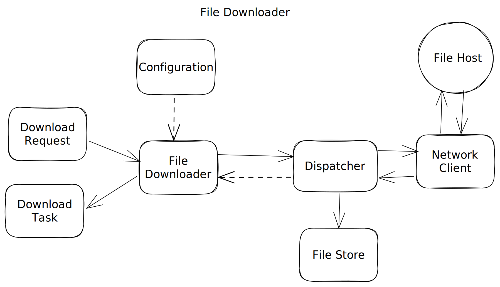
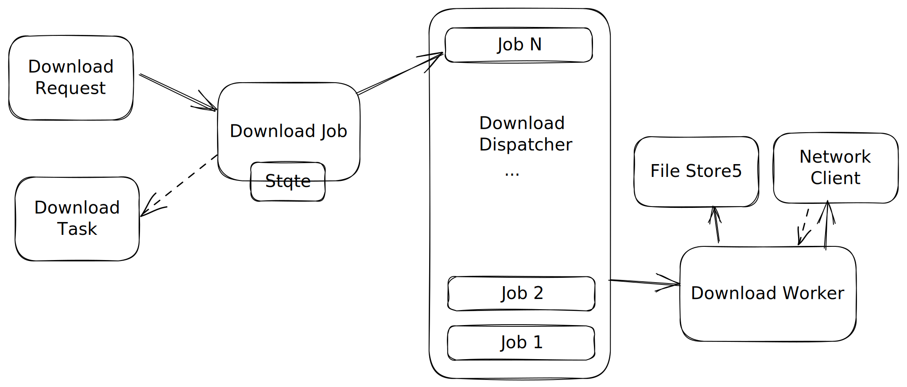

# File Downloader

- Design a File Downloader Library

## Requirement Gathering

### Functional Requirements
- A general purpose library which downloads files from internet and saves to disk
- It should support pause/resume/cancel/listing of file downloads
- It should support simultaneous download of multiple files. We should put an upper limit on the no. of simultaneous downloads possible as after a certain point having too many simultaneous downloads will impact performance and not give any improvements, the ideal no. should be close to the no. of cores to 4 * no. of cores as most jobs which are running simultaneously will be blocked on network I/O
- It should support listing active downloads

### Non-functional Requirements
- Limited active simultaneous downloads
- Unlimited download file size

### Out of scope
- Login/Authentication
- Resumable HTTP-downloads

## Client Public API
```
FileDownloader:
+ init(init: FileDownloaderConfig)
+ download(request: FileDownloadRequest): FileDownloadTask
+ pauseAll()
+ resumeAll()
+ cancelAll()
+ activeDownloads(): [FileDownloadTask]

FileDownloaderConfig:
+ init(maxParallelDownloads: Int)

FileDownloadRequest:
+ init(sourceUrl: Url, destPath: String)

FileDownloadTask:
+ addDownloadCallback(callback: FileDownloadCallback)
+ pause()
+ resume()
+ cancel()

FileDownloadCallback:
+ onComplete(request: FileDownloadRequest)
+ onFail(request: FileDownloadRequest, error: String)
+ onCancel(request: FileDownloadRequest)
```

- **FileDownloader** - Represents a single file downloader instance. Schedules and maintains active downloads
- **FileDownloaderConfig** - Encapsulates file downloader config. Simplifies downloader instance creation and future refactorings. Alternatively you can suggest builder pattern
- **FileDownloadRequest** - Encapsulates file download request (source, destination, headers etc)
- **FileDownloadTask** - A handle to asynchronous file download operation. Is useful to pause, resume, cancel a download as well to notify download completion
- **FileDownloadCallback** - Encapsulate completion/failure/cancel callback

## High-Level Diagram


### Components
- **File Downloader** - The central component which provides the client API and brings all components together
- **Download Request** - encapsulates a single file download request and is accepted by file downloader as input
- **Download Task** - represents an asynchronous download operation produced as output by file downloader
- **Download Dispatcher** - schedules and dispatches download operations
- **Network Client** - handles receiving bytes over HTTP
- **File Store** - writes file content to the disk

## Deep Dive

### Download Dispatcher
- A download dispatcher consists of a queue of jobs which are processed by a pool of download workers. Each job consists of a download request, a download task and a state (`PENDING`, `ACTIVE`, `PAUSED`, `COMPLETED`, `FAILED`). A job initially is in `PENDING` state, a download worker processes a pending or paused job and moves it into `ACTIVE` state, an active job can be `PAUSED` by the user and finally a job either moves into `COMPLETED` state on successful download or `FAILED` state if user cancels the download or it fails due to some error



## Classes Involved

