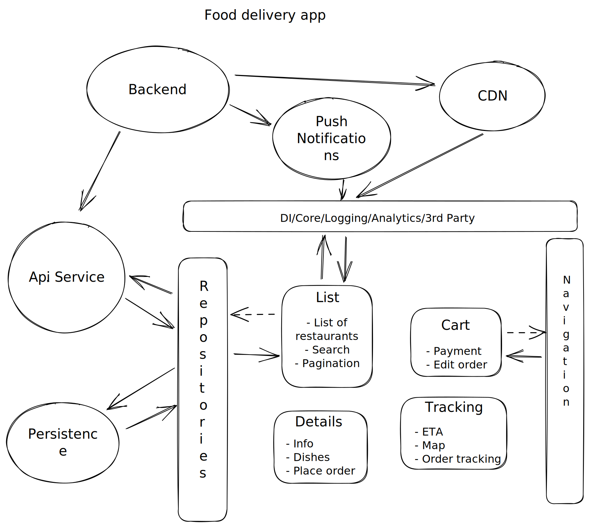
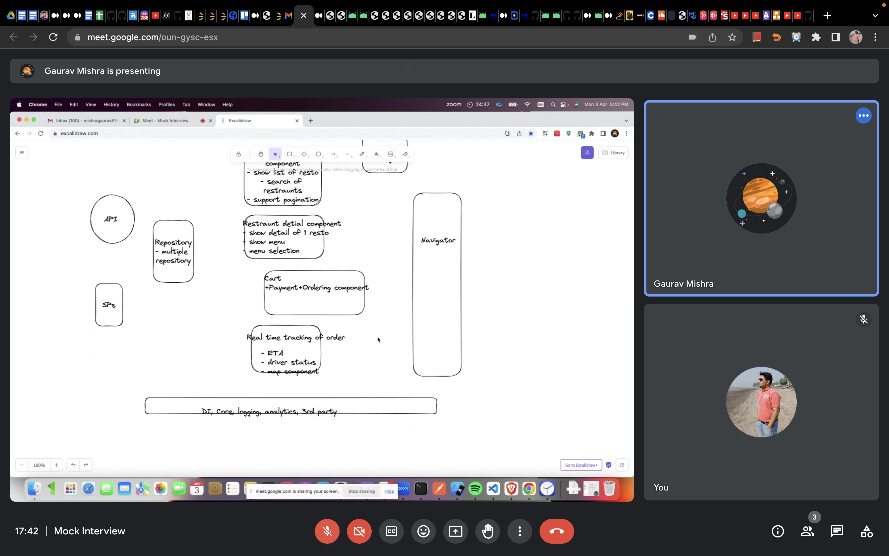

# Food Delivery App

## Design a food delivery app like zomato or swiggy

### Requirement Gathering

#### Functional requirements
- Show a list of nearby restaurants
- Show a restaurants details (opening-closing time, dishes and their info)
- Add dishes to cart
- Cart page
- Order tracking page

#### Non-functional requirements
- Should support lower-end devices
- Should work in flaky internet conditions

#### Out of scope
- Authentication
- Highlighted/Promoted restaurants
- Discounts/Offers

### High-level diagram

### Flow
- The app will start with the restaurant listing page which will request `RestaurantListViewModel` to fetch a list of restaurants to display
- The RestaurantListViewModel will call the `RestaurantsRepository` to fetch the list of restaurants
- The RestaurantRepository will fetch the list of restaurants via the API service
- The API service will call the backend to fetch a list of restaurants
- The backend component will send a list of nearby restaurants (paginated) basis the lat long provided to the API service
- The API service will send this back to RestaurantsRepository, which will send it back to ResttaurantListViewModel
- The RestaurantListViewModel will post this list of restaurants via live data which would be under observation of the Restaurant Listing Page.
- All pages (Restaurant Details, Cart, Order Tracking will follow somewhat similar flow)
- Restaurant Listing would be done using a recycler view.
- On clicking on a particular restaurant item view its detail page would be opened
- The restaurant detail page would display information like address of the restaurant, its opening and closing time, whether it is serviceable and its menu in a list form 
- After selecting the dishes user wants to order and placing the order, user would be taken to the cart page where he will be shown a summary of his order with detailed pricing information
- On placing the order user would be taken to the order tracking page where his order's status would be shown, things like expected delivery time, who is delivering the order, a map component showing the orders current location etc

### Components

- **The backend component** is responsible for responding to API service component and returning appropriate response. The main API calls would be: 
    - get restaurant list `GET /restaurants?lat=<float>&&long=<float>` which will return a list of restaurants for the given lat long basis proximity of the restaurant to the lat long, whether the restaurant is serviceable or not right now and other user specific factors
    - get restaurant details `GET /restaurant/<id>` which will return detailed information related to the restaurant with id `<id>`. It will contain information like opening and closing time of the restaurant, whether it is serviceable right now, address, service/delivery charges, list of dishes, list of offers etc.
    - add to cart `POST/PUT /cart` which will create/update cart to include the dishes mentioned in the body to be included in users cart
    - place order `POST /order` which will create/place an order of the things currently in users cart
    - get order details `GET /order?orderId=<id>` which will return information related to the order with id <id>, this will contain information like the status of the order which can be `PROCESSING`, `OUT FOR DELIVERY`, `DELIVERED` etc
    - It will also communicate with the push notification service to send notifications to users and also the CDN component which will store static content like images and js bundles for faster delivery
- **The restaurant listing component** consist of the restaurant listing page (which can be an activity or fragment) and restaurant listing view model and will be responsible for fetching the list of nearby restaurants depending on users location and rendering them as a list. We can also provide an option to search for a restaurant on this page and given the list of restaurants can be huge, the get restaurants call will be paginated
- **The restaurant details component** -  
- **The cart component**
- **The order tracking component**
    
#### Deep dive
    
    
### API Design
    
### Protocols
    
### Storage
    

