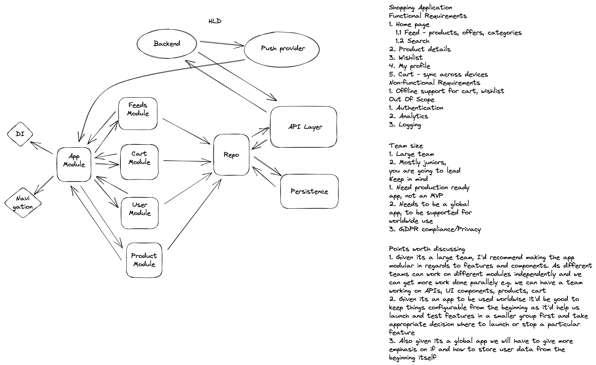

# Shopping App

## Requirement Gathering
### Functional Requirements
- A home page showing a list of products, offers, categories, search etc
- Product details
- Cart and order flow
- Wishlist and my profile
### Non-functional requirements
- Cart should sync across devices
- Offline capability to access cart and wishlist
- App to be used at a global scale
### Out of scope
- Authentication
- Logging
- Analytics
### Things to keep in mind
- Large team
- Production quality app
- Privacy

## HLD

## Deep dive
### Basic flow 
1. The UI (Activity/Fragment/View) will request for data to populate itself to the View State Manager (View Model/Presenter). I will prefer View Model due to less coupling of it with the UI as well as it retaining information even on configuration change
2. The View state manager will request the data from the repository. 
3. The repository will depending on the network state and use case request the data from the api layer or persistence.
    1. In most cases when internet is available the repository will request the data from api layer
    2. Save it to persistence which is our source of truth
    3. And return the requested data to the manager
4. The view state manager will notify the observers of the data
5. The UI will update itself on the basis of data fetched

## Feed flow
1. The UI will request for feeds from the view model on its creations and pre fetch feeds on subsequent scrolls to the end of the list. Say when we reach the xth element from the end we make the call to fetch the next y elements (y > x). This provides better user experience as content is loaded sooner than if we were to fetch the content when user reached the end of it.
2. The view model will store the current state of the UI and will make a paginated call to the repository to get the correct/next set of feeds. For pagination we can use offset pagination for its simplicity as the chances of things getting added or removed is less
3. The repository will make a **GET** call to fetch the next set of feeds *v1/feeds?offset=x&limit=y*
4. We won't be persisting any of this data as it is time/price sensitive. If the requirement is to show content offline as well we can do it in following ways:
    1. Show users wishlist or last seen products list. We can store this list offline in SQL. We will be syncing both these lists with backend to keep it consistent across devices
    2. We persist the first page content only. We can have some sort of visual indicator notifying the user that he is in offline state and the prices/offers might not be upto date. This is simple to maintain and is better than showing no data
    3. We persist all the data we fetched from the previous session i.e. whenever we fetch the first page of data and try to persist we clear the paginated data stored so far in the db. This keeps the data consistent in offline scenario as well.
6. We would want to show different feed at different times of the year as well as in different regions, hence we should keep our UI as flexible as possible. I'd recommend using Server-driven UI for this usecase. 
    1. For server-driven UI we can create our own framework, or use Jetpack Compose or one of the 3rd party tools available like epoxy, proteus, litho, graywater etc
    2. If we are going to use our own framework we can use inheritance and abstraction to create an entity framework to support different types of views. 
    3. We can use the concept of Suppressed Entity to support backward compatibility. What a suppressed entity basically is, is when a new entity is added to the framework which was not supported in a previous version our parser will default such entities to a suppressed entity which will have a view type mapped to it which has 0 height or which has its visibility set to gone

**Key things to mention** - Pagination, API contract, network->DB->UI flow, offline flow handling, Server driven UI, Suppressed Entity

## Cart flow
1. In case of cart, it is important to keep the cart in sync and consistent with backend. We can sync the cart whenever the app opens and whenever user modifies the cart
2. In case of conflict we can use a simple strategy of last write wins i.e. if there are two or more updates to cart which are conflicting we can use the update with higher timestamp and discard the others as that was the latest decision made by the user
3. We can store the current cart status in DB and not shared preferences as the size of the cart can become large.
4. In case of API failure while syncing cart we can show the cart which we have stored in DB.
5. To keep the cart in sync across devices we can push the updates to all other devices via notification

## Product details flow
1. Product detail UI will receive a product id in its intent and pass this intent to view model/presenter to get the product info. View model will request the product repository to get product details. The product repository will make a network request to fetch product details and pass it to the view model who will publish the response which the UI will be listening to.
2. I would not like to store product info offline as the content is price sensitive and prices can change anytime, but if there is a good reason we can store product info in product table and show some sort of a visual indicator, to let the user know that prices might have changed or maybe hide the price and notify the user that prices are not visible becuase he is offline

## Profile flow
1. Profile can contain users basic content like his name, list of addresses (billing, shipping), payment related info, wishlist, purchase history, wallet etc

## Search flow
1. For search we can use similar construct as we used for feed page. We can have a server driven UI of sorts and it can be a hybrid of products and offers
